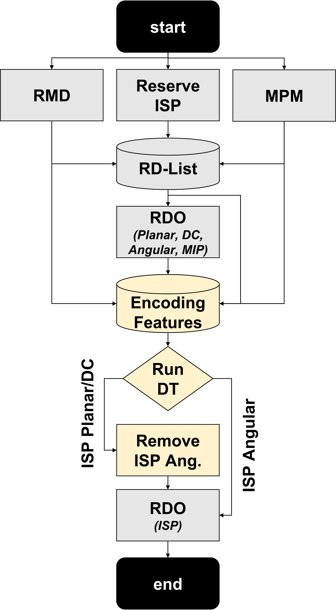

# Fast ISP Mode Decision for the Versatile Video Coding Intra Prediction Using Machine Learning

This repository contains the source code of the machine-learning-based solution proposed in the paper **"Fast ISP Mode Decision for the Versatile Video Coding Intra Prediction Using Machine Learning"**.

The proposed solution uses a Decision Tree to predict the most promising Intra Subpartition Prediction (ISP) modes during the VVC intra prediction process, reducing the number of modes that need to be fully evaluated by the rate-distortion optimization (RDO) process.

## Associated Publication

**Fast ISP Mode Decision for the Versatile Video Coding Intra Prediction Using Machine Learning**

Larissa Araújo, Adson Duarte, Bruno Zatt, Guilherme Corrêa, and Daniel Palomino.

*Proceedings of the 30th Brazilian Symposium on Multimedia and the Web (WebMedia 2024)*.

**Paper:** [SBC OpenLib](https://sol.sbc.org.br/index.php/webmedia/article/view/30309)

## Abstract

The Versatile Video Coding (VVC) standard achieves high compression rates by introducing new encoding tools, such as the Intra Subpartition Prediction (ISP). However, the ISP increases the computational effort necessary to perform the mode decision of the intra prediction step. This paper proposes a fast intra-mode decision solution for the ISP using machine learning. A Decision Tree is employed to predict the most promising ISP modes to be optimal to avoid the costly RDO test of ISP modes that are less likely to be chosen. By reducing the number of modes fully evaluated by the RDO process, the proposed solution achieves an average time-saving of 3.15% with only 0.11% of coding efficiency loss when tested for the common test conditions of VVC. Unlike the related works, our solution avoids the time overhead of calculating image features by adopting features from the encoding process. Compared with related works, our solution presents competitive time-saving and coding efficiency results.

## Proposed Solution

The proposed solution uses a **Decision Tree** to predict which ISP modes are more likely to be selected as optimal during the VVC intra-mode decision process.

By avoiding the RDO evaluation of less promising ISP modes, the proposed approach reduces the computational complexity of the ISP mode decision while maintaining coding efficiency.

<p align="center">
  
</p>

<p align="center">
  <em>Overview of the proposed machine-learning-based ISP mode decision solution.</em>
</p>

## Results

When evaluated under the common test conditions of VVC, the proposed solution achieves:

* **3.15% average time-saving**
* **0.11% coding efficiency loss**

The proposed solution also avoids the overhead associated with calculating additional image features by using features already available during the encoding process.

For a detailed description of the methodology and experimental results, please refer to the associated publication.

## Software Version

This repository is based on **VTM 18.0**.

For the environment used during development and experimentation, the following configuration is recommended:

* **Operating system:** Ubuntu 20.04
* **GCC:** 9.4.0
* **CMake**
* **GNU Make**

The recommended GCC version is **9.4.0**, which is available in Ubuntu 20.04. Other operating systems, compiler versions, or configurations may work, but they have not been tested with this repository.

## Compilation

Clone this repository and enter its root directory:

```bash
git clone <repository-url>
cd <repository-directory>
```

Create a build directory:

```bash
mkdir build
cd build
```

Configure the project using CMake in Release mode:

```bash
cmake .. -DCMAKE_BUILD_TYPE=Release
```

Compile the encoder:

```bash
make -j 6
```

The `-j 6` option instructs `make` to use six parallel compilation processes. If your system has fewer available CPU cores, a smaller value can be used, for example:

```bash
make -j 4
```

or:

```bash
make -j 2
```

After compilation, the encoder executable will be available in the `bin` directory.

## Video Encoding

The compiled encoder can be used to encode a YUV video sequence using the VVC intra configuration.

For example, to encode the `RaceHorses` sequence using **QP 22**:

```bash
cd ../bin

./EncoderAppStatic \
    -c ../cfg/encoder_intra_vtm.cfg \
    -c ../cfg/per-sequence/RaceHorses.cfg \
    -q 22 \
    -i RaceHorses.yuv
```

In this example:

* `-c ../cfg/encoder_intra_vtm.cfg` specifies the VVC intra coding configuration.
* `-c ../cfg/per-sequence/RaceHorses.cfg` specifies the configuration for the `RaceHorses` sequence.
* `-q 22` specifies the **Quantization Parameter (QP)**. In this example, the encoder uses **QP 22**.
* `-i RaceHorses.yuv` specifies the input YUV video file.

The input YUV file must be accessible from the location specified by the `-i` argument. For example, if `RaceHorses.yuv` is located inside the `bin` directory, the command above can be used directly.

The QP can be changed by modifying the value passed to the `-q` argument. For example:

```bash
-q 27
```

encodes the sequence using QP 27.

## Reproducibility

To reproduce the experiments reported in the associated paper, use **VTM 18.0** together with the recommended software environment described above.

The input video sequences used in the experiments are not included in this repository. They must be obtained separately from their respective publicly available video datasets.

## Citation

If you use this code in your research, please cite the following paper:

```bibtex
@inproceedings{webmedia,
    author = {Larissa Araújo and Adson Duarte and Bruno Zatt and Guilherme Correa and Daniel Palomino},
    title = { Fast ISP Mode Decision for the Versatile Video Coding Intra Prediction Using Machine Learning},
    booktitle = {Proceedings of the 30th Brazilian Symposium on Multimedia and the Web},
    location = {Juiz de Fora/MG},
    year = {2024},
    keywords = {},
    issn = {0000-0000},
    pages = {162--170},
    publisher = {SBC},
    address = {Porto Alegre, RS, Brasil},
    doi = {10.5753/webmedia.2024.241692},
    url = {https://sol.sbc.org.br/index.php/webmedia/article/view/30309}
}


```

## License

This repository contains modifications to the VVC Test Model (VTM). Please refer to the original VTM license and licensing terms applicable to the source code included in this repository.
